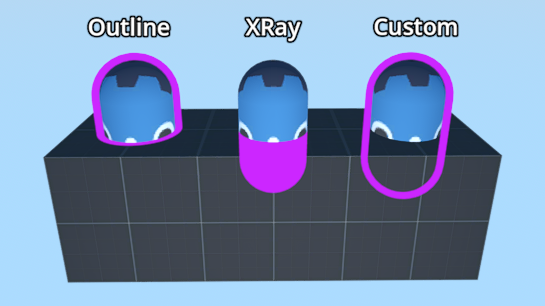
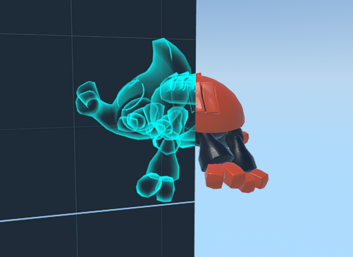
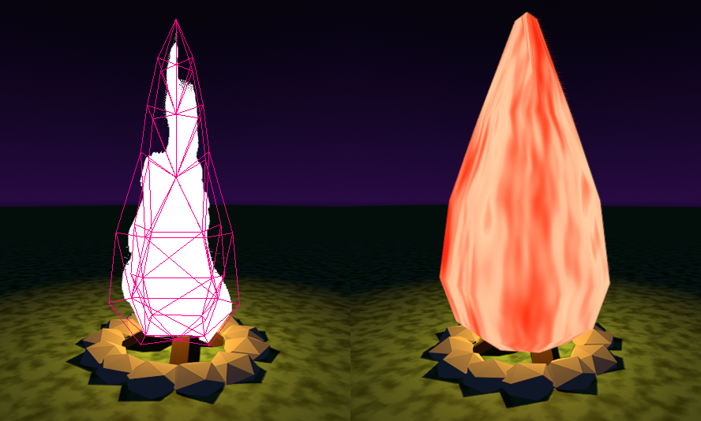

# Godot Stencil Demo

A demo made to show the capabilities of stencil effects in Godot.

## Outlines and X-Rays

The Outline and X-Ray examples are the built-in stencil modes provided by BaseMaterial3D.

The custom outline is an example of an effect made with the custom stencil mode.

## Custom X-Ray

A slightly more interesting x-ray effect.

## Wind Waker Lights

[ww_light.webm](https://github.com/user-attachments/assets/2aaee72c-0656-4e96-89cf-cfdd70490389)

An imitation of the simple lighting effects used in Wind Waker.

Very similar to stencil shadows.

Requires a 3-pass material with a script to enforce a global ordering.

## Campfire

[campfire.webm](https://github.com/user-attachments/assets/2497dbac-1567-454f-9db6-702418571081)

A very stylized flame effect achieved entirely with StandardMaterial3D.

